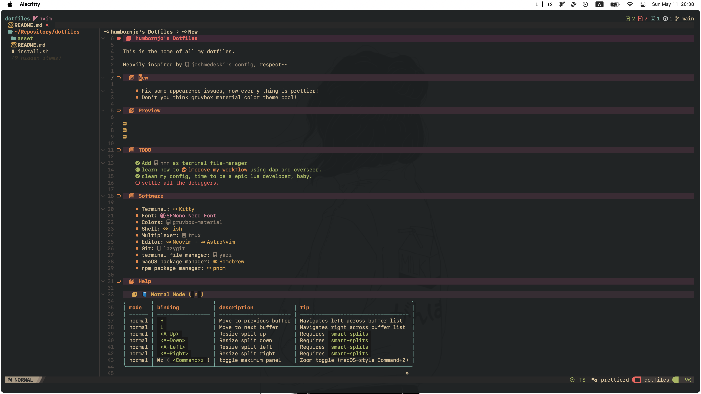
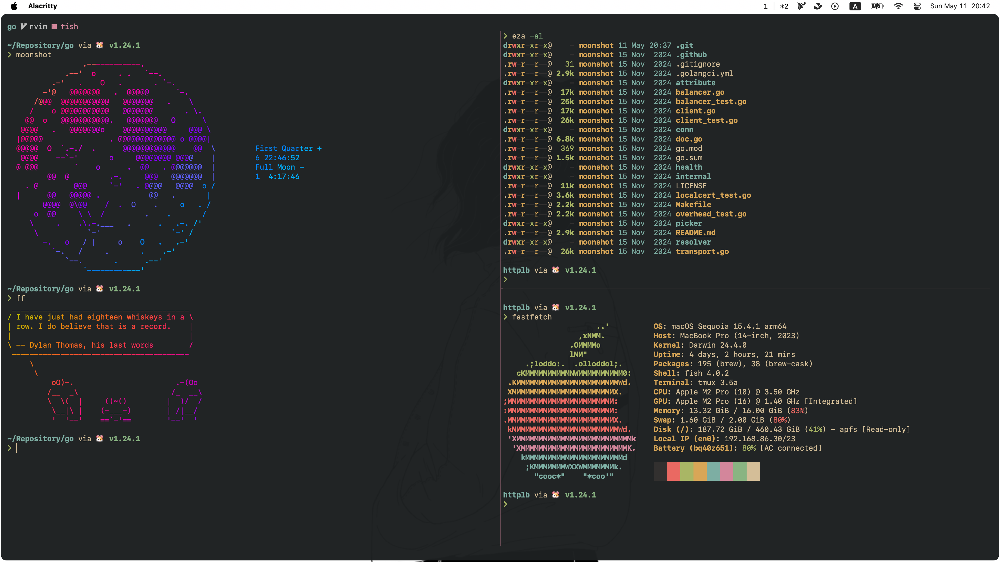
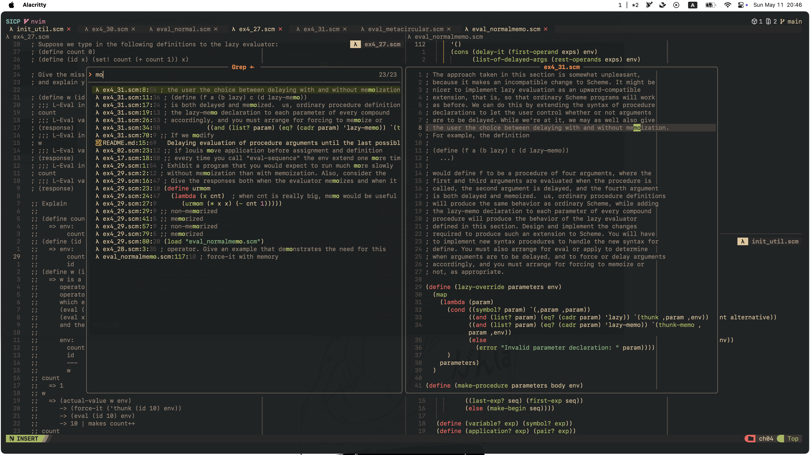

# humbornjo's Dotfiles

This is the home of all my dotfiles.

Heavily inspired by [joshmedeski's config](https://github.com/joshmedeski/dotfiles), respect~~

## New

- Fix some appearence issues, now ever'y thing is prettier!
- Don't you think gruvbox material color theme cool!

## Preview

## TODO

- [x] ~~Add [nnn](https://github.com/jarun/nnn) as terminal file-manager~~
- [x] learn how to [improve my workflow](https://www.reddit.com/r/neovim/comments/w8n831/use_overseernvim_to_run_commands_on_save/) using dap and overseer.
- [x] clean my config, time to be a epic lua developer, baby.
- [x] settle all the debuggers.

## Software

- Terminal: [Kitty](https://sw.kovidgoyal.net/kitty/)
- Font: [SFMono Nerd Font](https://github.com/epk/SF-Mono-Nerd-Font/issues/4)
- Colors: [gruvbox-material](https://github.com/f4z3r/gruvbox-material.nvim)
- Shell: [fish](https://fishshell.com)
- Multiplexer: [tmux](https://github.com/tmux/tmux/wiki)
- Editor: [Neovim](https://neovim.io) + [AstroNvim](https://astronvim.com/)
- Git: [lazygit](https://github.com/jesseduffield/lazygit)
- terminal file manager: [yazi](https://github.com/sxyazi/yazi)
- macOS package manager: [Homebrew](https://brew.sh)
- npm package manager: [pnpm](https://pnpm.io/)

## Help

### 📘 Normal Mode (`n`)

| mode   | binding           | description             | tip                                 |
| ------ | ----------------- | ----------------------- | ----------------------------------- |
| normal | `H`               | Move to previous buffer | Navigates left across buffer list   |
| normal | `L`               | Move to next buffer     | Navigates right across buffer list  |
| normal | `<A-Up>`          | Resize split up         | Requires `smart-splits`             |
| normal | `<A-Down>`        | Resize split down       | Requires `smart-splits`             |
| normal | `<A-Left>`        | Resize split left       | Requires `smart-splits`             |
| normal | `<A-Right>`       | Resize split right      | Requires `smart-splits`             |
| normal | ⌘z (`<Command>z`) | toggle maximum panel    | Zoom toggle (macOS-style Command+Z) |

---

### 📘 Insert Mode (`i`)

| mode   | binding | description                           | tip                   |
| ------ | ------- | ------------------------------------- | --------------------- |
| insert | `<C-j>` | move cursor down                      | arrow key remap       |
| insert | `<C-k>` | move cursor up                        | arrow key remap       |
| insert | `<C-h>` | move cursor to start of previous word | -                     |
| insert | `<C-l>` | move cursor to start of next word     | -                     |
| insert | `<C-a>` | move to beginning of line             | -                     |
| insert | `<C-e>` | move to end of line                   | -                     |
| insert | `<C-w>` | delete previous word                  | standard Vim behavior |
| insert | `<C-s>` | delete to start of next word          | -                     |
| insert | `<A-w>` | delete char to the left (backspace)   | -                     |
| insert | `<A-s>` | delete char to the right (delete key) | -                     |

## Hardware

- Laptop: macbook air (14-inch, 2022, Apple M2 Chip, 16GB RAM)
- Keyboard: Logitech MX Keys M
- Mouse: Logitech MX Master 3S
