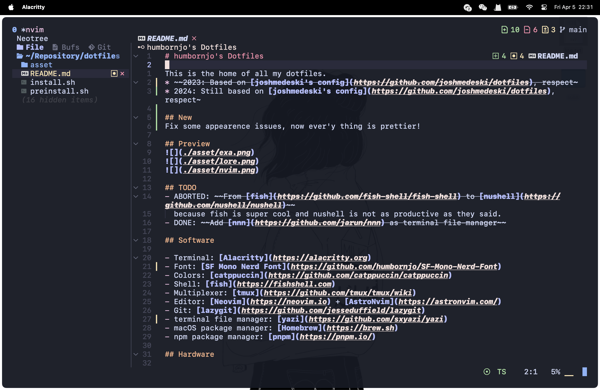

# humbornjo's Dotfiles

This is the home of all my dotfiles.

Heavily inspired by [joshmedeski's config](https://github.com/joshmedeski/dotfiles), respect~~

## New

- Fix some appearence issues, now ever'y thing is prettier!
- Don't you think gruvbox material color theme cool!

## Preview

## TODO

- [x] ~~Add [nnn](https://github.com/jarun/nnn) as terminal file-manager~~
- [x] learn how to [improve my workflow](https://www.reddit.com/r/neovim/comments/w8n831/use_overseernvim_to_run_commands_on_save/) using dap and overseer.
- [ ] clean my config, time to be a epic lua developer, baby.

## Software

- Terminal: [Kitty](https://sw.kovidgoyal.net/kitty/)
- Font: [Lilex](https://github.com/mishamyrt/Lilex)
- Colors: [gruvbox-material](https://github.com/f4z3r/gruvbox-material.nvim)
- Shell: [fish](https://fishshell.com)
- Multiplexer: [tmux](https://github.com/tmux/tmux/wiki)
- Editor: [Neovim](https://neovim.io) + [AstroNvim](https://astronvim.com/)
- Git: [lazygit](https://github.com/jesseduffield/lazygit)
- terminal file manager: [yazi](https://github.com/sxyazi/yazi)
- macOS package manager: [Homebrew](https://brew.sh)
- npm package manager: [pnpm](https://pnpm.io/)

## Help

| mode   | binding | description                               | tip                   |
| ------ | ------- | ----------------------------------------- | --------------------- |
| insert | C-b     | move cursor to the start of previous word | b stand for backwards |
| insert | C-n     | move cursor to the start of next word     | -                     |
| insert | C-f     | move cursor to the start of current line  | f stand for front     |
| insert | C-r     | move cursor to the end of current line    | r stand for rear      |

## Hardware

- Laptop: macbook air (14-inch, 2022, Apple M2 Chip, 16GB RAM)
- Keyboard: Vanilla
- Mouse: Logitech MX Master 3S
